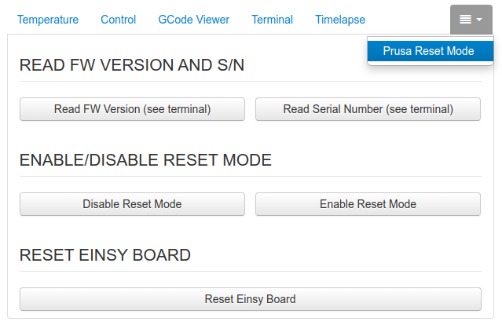

# OctoPrint-PrusaResetMode

This is a simple plugin to prevent your Prusa printer from resetting when OctoPrint connects.

When OctoPrint connects to Prusa printers, it restarts them causing any ongoing prints to fail.
This is a necessary feature to update the printer firmware, but it makes the power panic useless.

There are numerous threads online referring to this problem, e.g.:
- [GitHub: MK3 When connecting to the printer with Octoprint the MK3 printer reboots every time](https://github.com/prusa3d/Prusa-Firmware/issues/1572)
- [GitHub: Connecting Repetier Server to USB port kills running print from SD card](https://github.com/prusa3d/Prusa-Firmware/issues/2374)
- [GitHub: Plugging USB destructively restarts printer](https://github.com/prusa3d/Prusa-Firmware/issues/1253)
- [Prusa Forum: Octoprint Reseting Printer + Power panics](https://forum.prusa3d.com/forum/original-prusa-i3-mk3s-mk3-user-mods-octoprint-enclosures-nozzles/octoprint-reseting-printer-power-panics/)

The easiest workaround is to send "hidden" commands to the printer's serial port, which allow you to enable and disable the Reset Mode: `;C32u2_RMD` and `;C32u2_RME`.

Unfortunately, these commands cannot be sent directly through the OctoPrint terminal because they begin with the character `;` and are interpreted as comments.

This plugin adds a tab to OctoPrint with buttons that allow you to conveniently enable and disable the Reset Mode.

Remember to reactivate Reset Mode before upgrading your printer firmware, or it will fail.

## Screenshots

## Setup

Install via the bundled [Plugin Manager](https://docs.octoprint.org/en/master/bundledplugins/pluginmanager.html)
or manually using this URL:

    [https://github.com/jacopotediosi/OctoPrint-PrusaResetMode/archive/main.zip]

## Tested On
I have only tested this plugin with OctoPrint 1.9.3 and my Prusa MK3S+ printer, but it should work with any printer using an ATmega32U2 as USB-serial chip (Prusa MK2, MK3, ...).

## Support My Efforts
I, jacopotediosi, programmed this plugin for fun and personal use. I will do my best effort to support those that have issues with it. Please return the favor and leave me a tip if you find this plugin helpful and want me to continue future development.

<small>No paypal.me? Send funds via PayPal to jacopotediosi&#64;gmail&#46;com

You can use [this](https://www.paypal.com/cgi-bin/webscr?cmd=_xclick&business=jacopotediosi@gmail.com) link too. But the normal PayPal fee will be deducted.
</small>
